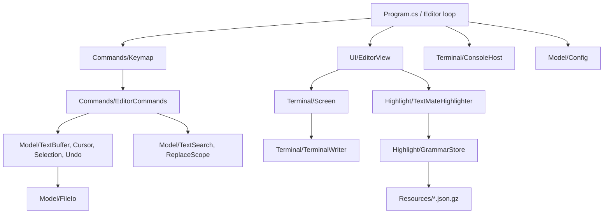

# Nib — repo map (2026-08-23)

## Purpose and shape

A nano-style console text editor for Windows. C# / .NET 10, single `nib.exe`,
TextMate syntax highlighting from vendored VS Code grammars, CUA clipboard
chords layered over nano muscle memory. Scope is explicitly "config files and
short scripts", not an IDE.

64 commits, single author, `main` at `cd936d8`, version `0.6.2`. Working tree
clean. 350 tests, all passing. Build clean with `TreatWarningsAsErrors`.

Layering is real and enforced by convention, not by tooling:

- `Terminal/` — Win32 P/Invoke, raw console mode, VT output, input records. Depends on nothing.
- `Model/` — buffer, cursor, selection, undo, file I/O, config, search, stats. **Must never reference `Terminal/`.** Holds.
- `Highlight/` — TextMateSharp wrapper, grammar/theme resources, per-line token cache.
- `UI/` — view, viewport, prompt, status/help bars. Depends on `Terminal` + `Model` + `Highlight`.
- `Commands/` — keymap and the `EditorCommands` verb layer.
- `Program.cs` — `Main`, arg parsing, and the whole `Editor` loop class.

## Entry points

Exactly one: `Program.Main` (`src/Nib/Program.cs:19`). Four modes off the command line:

| Mode | Trigger | Path |
|---|---|---|
| Editor | default | `FileIo.Load` → `ConsoleHost.Acquire` → `Editor.Run` |
| Probe | `--probe` | `Probe.Run(host)` — phase-1 terminal diagnostic |
| Soak | `--soak [dir] [passes]` | `Highlight.Soak.Run` — no console acquisition |
| Info | `--help` / `--version` | plain stdout, exit 0 |

No services, no jobs, no network. Nothing runs on a timer.

## Data

No database. Two persistent surfaces:

| Store | Written by | Schema changes |
|---|---|---|
| The edited file | `FileIo.Save` (`Model/FileIo.cs:34`) — temp file in the same directory, then `File.Replace` | n/a |
| `%APPDATA%\nib\config.toml` | **never written.** Read-only, hand-rolled parser (`Model/Config.cs:52`) | n/a — 4 keys, no schema, unknown keys reported not fatal |

The load/save contract is the project's core invariant: encoding (BOM sniff, UTF-8
strict with Latin-1 fallback) and *per-line* terminators are preserved, so an
untouched file round-trips byte-identical. `FileIoRoundTripTests` covers it.

## External surfaces

- **Network:** none at runtime. `scripts/fetch-grammars.ps1` fetches from GitHub, but it is a dev tool and the `.gz` outputs are committed.
- **Secrets:** none. `git log -p` grep for key/token/password/secret is clean.
- **Files written:** the edited file, its `.<name>.nib-tmp` sibling during save, and `%TEMP%\.net\nib\<hash>` (the runtime's native-library extraction for single-file publish).
- **Registry:** `install.ps1` writes `HKCU\Environment\Path` with the value kind preserved and broadcasts `WM_SETTINGCHANGE`.

## Hot paths

1. `Editor.Run` (`Program.cs:315`) — blocking `ReadBatch`, then `Keymap.Handle` per event, then one `Draw()` per batch.
2. `Editor.Draw` (`Program.cs:395`) — clamp/scroll, `TokenizeWindow`, `EditorView.Render`, `Screen.Render`, one flush.
3. `Screen.Render` (`Terminal/Screen.cs:371`) — back/front cell diff, minimal cursor-move + SGR runs. Persists SGR state across frames so an idle frame emits nothing.
4. `EditorCommands.ApplyReplace` (`Commands/EditorCommands.cs:410`) — the single primitive every mutation reduces to; also where the undo record is written.
5. `TextMateHighlighter.Walk` (`Highlight/TextMateHighlighter.cs:210`) — incremental re-tokenize that stops on carry-state convergence.

## Ship-readiness inventory

Present: README that gets a stranger running in five minutes, `--help` that matches
reality, `--version` sourced from one `<Version>` in the csproj, MIT LICENSE, 350
tests, a release script that runs the suite and smoke-tests the staged exe, an
installer with `-WhatIf` and `-Uninstall`, four docs (ARCHITECTURE / BUILD /
ROADMAP / PRD) that are unusually honest about tradeoffs.

Absent: CI, a lockfile, a CHANGELOG, git tags.

## What I couldn't determine

- Whether the phase-6 features have had the hardware pass CLAUDE.md says they still want. I read the code and ran the suite; I did not drive the editor interactively.
- Real-world save behaviour on a Dropbox/OneDrive-synced path, where `File.Replace` can contend with the sync client. Would need a live trial.
- Whether the ~135 ms startup figure still holds at 0.6.2. I did not measure it.
- Whether legacy conhost (pre-Windows Terminal) actually degrades as designed — no such host available here.
