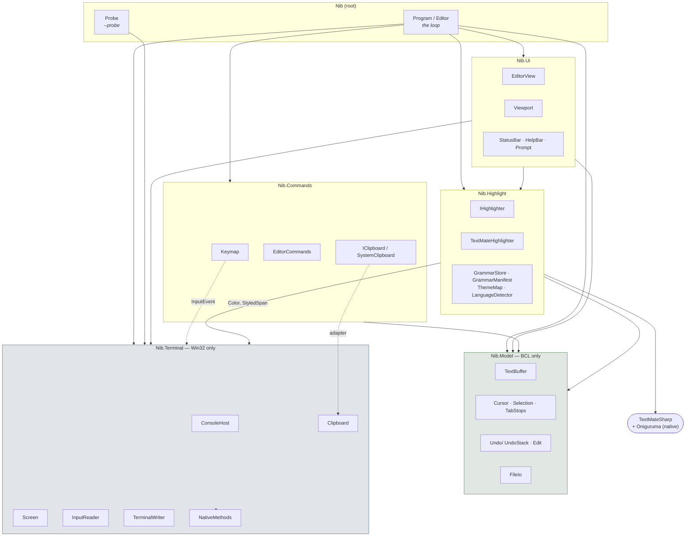
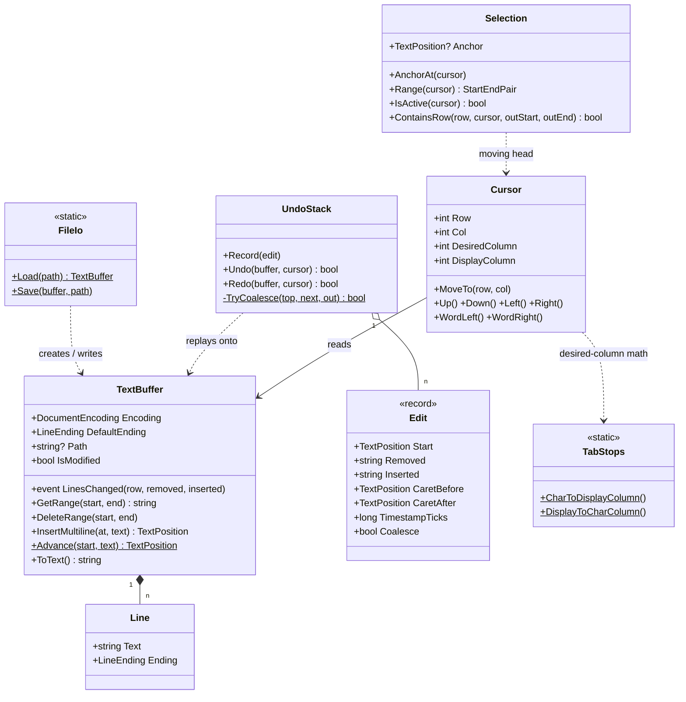
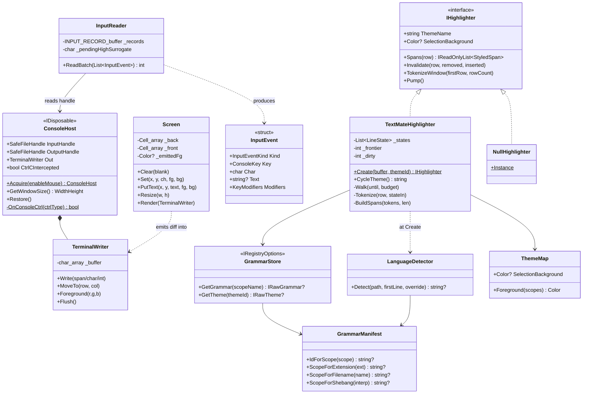
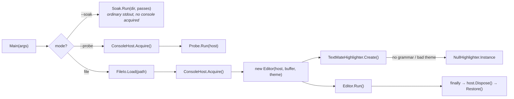
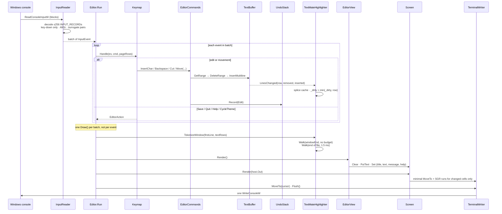
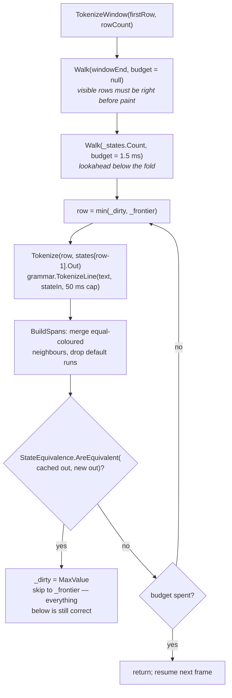
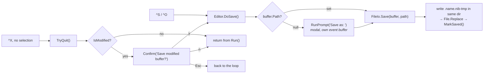

# Architecture Map — Nib

_Mapped 2026-07-27 · `src/Nib/` only · 34 files, 5 namespaces, ~3,700 lines · C# / .NET 10, no TUI framework_

> Companion to [CLAUDE.md](CLAUDE.md) and [ROADMAP.md](ROADMAP.md), not a replacement.
> `CLAUDE.md` records *why* the hard parts are the way they are (the Win32 landmines,
> the TextMateSharp landmines) and is the authority on those. This file records the
> *shape*: what depends on what, which types carry the design, and what actually
> happens on a keystroke.

## What this is

Nib is a nano-style console text editor for Windows: one file in memory, hand-rolled
VT rendering over `WriteConsoleW`, structured input from `ReadConsoleInputW`, and
TextMate syntax highlighting from vendored VS Code grammars.

The shape is a **layered core with a single loop on top**. A console-free editing
core (`Model/`) sits at the bottom next to a model-free terminal layer
(`Terminal/`); `Highlight/`, `Ui/`, and `Commands/` bridge them; and one class —
`Editor` in [Program.cs](src/Nib/Program.cs) — owns the read-input → mutate →
repaint cycle that drives everything. There is no dependency-injection container,
no event bus, and exactly one domain event in the whole program.

---

## System map

**The spine is `Model/` and `Terminal/`, and neither knows the other exists.** That
is the project's one architectural rule and it holds: `Model/` contains zero
`using Nib.*` directives and no qualified reference to any other namespace. Every
other layer leans on one or both.

Reading the graph:

- **`Terminal/`** is the Win32 transcription layer — 18 P/Invokes in
  [NativeMethods.cs](src/Nib/Terminal/NativeMethods.cs), and five types over them.
  It knows nothing about text buffers, cursors, or files.
- **`Model/`** is the editing core. Buffer, cursor, selection, undo, tab arithmetic,
  and byte-preserving load/save, all testable with no console attached — which is
  the point, because undo × selection is where the subtle bugs live.
- **`Commands/`** is the thinnest layer. `EditorCommands` itself imports only
  `Model/`; the two files that touch `Terminal/` do so at arm's length —
  `Keymap` reads an `InputEvent`, and `SystemClipboard` is a four-line adapter
  behind `IClipboard` so cut/copy/paste can be tested with a fake.
- **`Highlight/`** is the only layer with a third-party dependency. It reaches
  `Terminal/` for `Color` alone.
- **`Ui/`** is the widest — it paints `Model/` state, in `Highlight/` colours,
  onto a `Terminal/` grid — and correspondingly the least reusable.

---

## Key components

### The editing core

Three things carry this design:

**`TextBuffer` is a `List<Line>` with three real verbs.** `GetRange`,
`DeleteRange`, and `InsertMultiline` are the primitives; everything else
(`InsertChar`, `SplitLine`, `DeleteBackward`) is convenience over them. The
terminator lives *per line* rather than per file, which is what makes a mixed-ending
config round-trip byte-for-byte — the stated single most important behaviour in the
project. `GetRange` reproduces the crossed terminators verbatim and
`InsertMultiline` restores them, so delete-then-reinsert is identity, and that
identity is what undo is built on.

**`Edit` is one shape for every mutation.** At `Start`, `Removed` became `Inserted`.
Typing, backspace, paste, cut, and select-then-type are all that record with
different fields filled in; undo swaps the two strings and redo swaps them back.
`Coalesce` + `TimestampTicks` merge a run of typing into one undo step (300 ms
window, same line, contiguous). The clock is injected so the coalescing is
deterministic under test.

**`Selection` stores only an anchor.** The moving head *is* the cursor, so
Shift+movement stretches the selection for free. This is also the design's one sharp
edge: the anchor is a raw `TextPosition` and the buffer can shrink underneath it.
[EditorCommands.SelectionRange()](src/Nib/Commands/EditorCommands.cs#L51) clamps
every read of it, and [ApplyReplace](src/Nib/Commands/EditorCommands.cs#L225) drops
the anchor unconditionally — the git history records a crash from exactly that stale
anchor, so both guards are load-bearing.

### The terminal and highlight layers

**`ConsoleHost` owns raw mode and the alternate screen, and its whole reason for
existing is `Restore()`.** Four independent paths reach it — `finally` in `Main`,
`ProcessExit`, `UnhandledException`, and the console control handler — and
`Interlocked.Exchange` makes it idempotent. Dying in raw mode leaves the user's
shell without echo or line editing.

**`Screen` is two `Cell[]` grids and a diff.** Painters write into the back grid;
`Render` walks it against the front, emits one cursor-move per contiguous run of
changed cells, and swaps. It tracks last-emitted SGR *across frames*, so an idle
frame emits literally nothing — which holds only because `Screen` is the sole thing
writing colour.

**`TextMateHighlighter` is a side table, deliberately.** `List<LineState>`
index-aligned to buffer rows, spliced in response to `TextBuffer.LinesChanged`. It
is not fields on `Model.Line`, because that would put TextMateSharp types inside the
namespace that exists to be BCL-only. `_frontier` (how far the sequential walk has
reached) and `_dirty` (lowest row an edit invalidated) are separate on purpose:
conflating them makes every keystroke redo hundreds of already-correct rows.

**`GrammarStore` implements TextMateSharp's `IRegistryOptions`, so the engine calls
*it*.** Grammars are gzipped embedded resources inflated on first request for their
scope — opening a `.ini` costs 735 bytes of inflate rather than parsing all ~777 KB.
`RawGrammarFixup.Apply` runs on that load path, before rule compilation, because
several VS Code grammars are malformed in ways VS Code tolerates and TextMateSharp
does not.

---

## How it flows

### 1. Startup

1. `Main` parses flags by hand — no options library. `--soak` and `--probe` are
   diagnostic modes that never become the editor.
2. **The file loads *before* the console is touched.** A bad path must print to a
   normal shell, not from inside the alternate screen buffer.
   [FileIo.Load](src/Nib/Model/FileIo.cs#L21) sniffs the BOM (UTF-32 before UTF-16 —
   the shorter mark is a prefix of the longer), falls back to Latin-1 if strict UTF-8
   throws, and splits into `Line`s that each remember their own terminator.
3. `ConsoleHost.Acquire` opens `CONIN$`/`CONOUT$` (not the std handles, which may be
   redirected), clears `ENABLE_PROCESSED_INPUT`/`LINE_INPUT`/`ECHO_INPUT`/
   `QUICK_EDIT_MODE`/`VIRTUAL_TERMINAL_INPUT`, sets
   `VIRTUAL_TERMINAL_PROCESSING` + `DISABLE_NEWLINE_AUTO_RETURN` on output, switches
   to the alternate screen, and registers the three restore hooks.
4. The `Editor` constructor wires the object graph: `Screen` sized from the window,
   `Viewport`, `Cursor`, `EditorView`, `EditorCommands` (with a `SystemClipboard`),
   `InputReader`, and the highlighter.
5. `TextMateHighlighter.Create` detects the scope, loads the grammar and theme, and
   **returns `NullHighlighter` on any failure**. It never throws — refusing to open a
   file because it couldn't be coloured would be worse than no colour.

### 2. The keystroke loop — the heart of it

What actually happens, in order:

1. **Input arrives in batches, not one key at a time.**
   [`InputReader.ReadBatch`](src/Nib/Terminal/InputReader.cs#L25) blocks on
   `ReadConsoleInputW`, then drains up to 256 records. This matters because a
   Ctrl+Shift+V paste delivers the clipboard as a burst of individual key events —
   one render frame per event would make a few-hundred-line paste visibly crawl.
   Decoding drops key-up and bare modifiers, recombines astral surrogate pairs across
   two records, and treats RightAlt+LeftCtrl+printable as text (AltGr, not a chord).
2. **`Keymap.Handle` is a flat switch that mostly acts inline.** Movement and edits
   are applied straight to `EditorCommands` and reported as `EditorAction.None`; only
   the four things needing the console or a modal prompt — Save, Quit, Help,
   CycleTheme — come back to the loop. Ctrl+X is context-dependent: cut with a
   selection, quit without.
3. **Every mutation funnels through one primitive.**
   [`ApplyReplace(start, end, inserted, coalesce)`](src/Nib/Commands/EditorCommands.cs#L225)
   clears the selection, captures `Removed` via `GetRange`, does
   `DeleteRange` then `InsertMultiline`, moves the caret, and records the inverse
   `Edit`. Undo correctness is a property of this one method rather than of nine
   separate verbs.
4. **`TextBuffer.Changed` fires the program's only domain event.**
   [`LinesChanged(row, removed, inserted)`](src/Nib/Model/TextBuffer.cs#L314) — an
   in-line edit is `(row, 1, 1)`, a split is `(row, 1, 2)`, a join is `(row, 2, 1)`.
   It lives on the buffer, not on `EditorCommands`, because undo and redo mutate the
   buffer directly and would otherwise bypass it. It is a plain
   `Action<int,int,int>`, so `Model/` stays free of everything downstream.
5. **The highlighter splices rather than discards.**
   `Invalidate` removes `removed` cache entries at `row`, inserts `inserted` fresh
   ones, realigns, shifts `_frontier`, and lowers `_dirty`. Keeping the rows *below*
   an edit is the entire trick — their cached carry state is what the walk compares
   against.
6. **A command that throws does not cost the buffer.** The `try/catch` is *inside*
   the per-event loop: `Recover` clamps the cursor (an out-of-range cursor would
   throw again on the very next frame) and reports on the message row. It is
   deliberately not a top-level handler — by the time an exception unwinds to `Main`,
   `ConsoleHost.Restore()` has already made the crash look like a clean exit and the
   buffer is gone.
7. **One `Draw()` per batch.** `Viewport` clamps and scrolls to the caret,
   `TokenizeWindow` brings the visible rows up to date, `EditorView.Render` paints
   into the back grid, `Screen.Render` diffs and emits, and one `Flush()` issues a
   single `WriteConsoleW`. Tokenizing happens *here*, before the painter runs —
   the render path never executes a regex.

### 3. Incremental re-tokenization — why highlighting is free

1. Line N's tokens depend on the rule stack line N-1 ended in, so the walk is
   strictly sequential from the top of the file. A region the walk hasn't reached
   renders plain — that is documented first-paint behaviour, not a bug.
2. After an edit, the walk restarts at `_dirty` and stops **the moment a line's new
   carry state matches its cached one**. Typing inside a string on line 3 of a
   20k-line file re-tokenizes line 3, sees the same state coming out, and stops.
3. That comparison goes through
   [`StateEquivalence.AreEquivalent`](src/Nib/Highlight/StateEquivalence.cs#L31), not
   `StateStack.Equals`, which is not structural. The difference is invisible for most
   grammars (they hand back the *same* object when a line leaves the state untouched,
   so reference equality happens to work) but YAML rebuilds its stack every line and
   never converged — every keystroke re-tokenized the whole visible window. YAML being
   most of what this editor is for, that comparison is load-bearing.
4. Everything below the visible window fills in on the **loop thread**, 1.5 ms per
   frame — not a worker. A background thread would read `TextBuffer` while the loop
   edits it, and `Model/` is not thread-safe. `Pump()` is a no-op kept on the
   interface so a future engine can background its work without the loop changing.

### 4. Save and quit

The write is atomic by way of a temp file in the *same directory* (a cross-volume
`File.Replace` degrades to a copy, defeating the point) followed by a replace — an
interrupted save leaves the original config untouched rather than truncated.

One subtlety worth knowing before touching this code: the modal prompt and confirm
lines run their own nested read loop, and they read into `_modalBatch`, a **separate**
list from `_batch`. The outer `foreach` over `_batch` is still live when a modal
opens; reusing the same list would throw *"Collection was modified"*.

---

## Where to start

Read these five, in this order — they unlock the rest:

1. **[CLAUDE.md](CLAUDE.md)** — not code, but the Win32 and TextMateSharp landmines
   are written down there precisely so they cost their diagnosis time once. Several
   things in `Terminal/` look removable until you've read it.
2. **[src/Nib/Program.cs](src/Nib/Program.cs)** — `Main` plus the whole `Editor`
   class. 354 lines, and it is the entire control flow of the program. Everything
   else is called from `Run()` or `Draw()`.
3. **[src/Nib/Model/TextBuffer.cs](src/Nib/Model/TextBuffer.cs)** — the data
   structure and the three range verbs. Read `GetRange`/`DeleteRange`/
   `InsertMultiline` together; the byte-preservation guarantee lives in how they
   handle terminators.
4. **[src/Nib/Commands/EditorCommands.cs](src/Nib/Commands/EditorCommands.cs)** —
   skip to `ApplyReplace` at the bottom and read outward. Every verb above it is a
   thin wrapper.
5. **[src/Nib/Highlight/TextMateHighlighter.cs](src/Nib/Highlight/TextMateHighlighter.cs)**
   — specifically `Invalidate` and `Walk`. The `_frontier`/`_dirty` distinction and
   the convergence check are the two ideas that make phase 5 cheap.

Then, as needed: [Terminal/ConsoleHost.cs](src/Nib/Terminal/ConsoleHost.cs) for the
raw-mode contract, [Terminal/Screen.cs](src/Nib/Terminal/Screen.cs) for the render
diff, and [Ui/EditorView.cs](src/Nib/UI/EditorView.cs) for the char-index →
display-column mapping (tabs, selection, spans, all walked in one pass).

---

## Notes & gaps

**How this map was built.** By hand, reading all 34 files in `src/Nib/`. The
`/repo-cartographer` analyzer only extracts Python and JS/TS, so there is no
`repo-map.json` behind this — no AST ground truth, no fan-in/fan-out metrics. The
layering claim *is* verified mechanically (`Model/` has zero `using Nib.*` and no
qualified cross-namespace reference); the call edges are from reading, so treat the
diagrams as a careful sketch rather than an exhaustive graph.

**Edges a static resolver would miss, and that matter here:**

- **`TextBuffer.LinesChanged` → `TextMateHighlighter.Invalidate`** is an event
  subscription made in the highlighter's constructor. It is the only thing coupling
  the buffer to the highlight cache, and grepping for `Invalidate` at the call site
  finds nothing.
- **`EditorCommands.Move(Action move, bool extend)`** takes a delegate.
  `Keymap` passes `cur.Up`, `cur.WordLeft`, `() => cmd.PageUp(rows)` and so on, so
  every cursor movement is an unresolvable indirect call.
- **`GrammarStore.GetGrammar` is called by TextMateSharp, not by us.** Control
  inverts at `new Registry(store)`: the engine calls back for every scope a grammar
  references, recursively. That is how one `.yml` open pulls in the six-file YAML
  dispatcher chain without anything in this repo naming those files.
- **`IHighlighter` and `IClipboard`** are two-implementation interfaces
  (`TextMateHighlighter`/`NullHighlighter`, `SystemClipboard`/test fake). The
  null-object path is taken silently on any highlighter setup failure.

**Corners that look dead and are not:**

- [Probe.cs](src/Nib/Probe.cs) is unreachable in normal use — `--probe` only. It is
  kept as a hardware regression check for the terminal foundation.
- `ConsoleHost.OnConsoleCtrl`'s `CTRL_C_EVENT` case is dead by design: with
  `ENABLE_PROCESSED_INPUT` cleared the event never fires. It exists so the input mode
  is not a single point of failure with nothing behind it.
- The AltGr branch in `InputReader.TryDecodeKey` never fires on a US layout. Removing
  it means German users cannot type `@` or `\`.

**Genuinely unexercised by the editor:**

- `Viewport.ScrollLines`, `ScrollColumns`, and `ClampHorizontal` are called only from
  `ViewportTests` — the editor scrolls exclusively through `EnsureVisible`.
  Likewise `ExpandLine`, which the renderer bypasses by expanding tabs inline.
- `NativeMethods.GetNumberOfConsoleInputEvents` is declared and never called.
- Mouse events are fully decoded by `InputReader` and then discarded by the loop
  (`if (ev.Kind == InputEventKind.Mouse) continue; // phase 6`).
- `LanguageDetector.Detect`'s `overrideScope` parameter is wired end-to-end but has
  no key bound to it yet — the future "set syntax" command.

**Scope of this map.** `src/Nib/` only, as requested. `tests/Nib.Tests/` (20 files,
158 tests) is not diagrammed, though it is worth knowing that `GrammarStoreTests`
loads every grammar *and makes it tokenize* — rule compilation is lazy, so loading
alone proves nothing.
